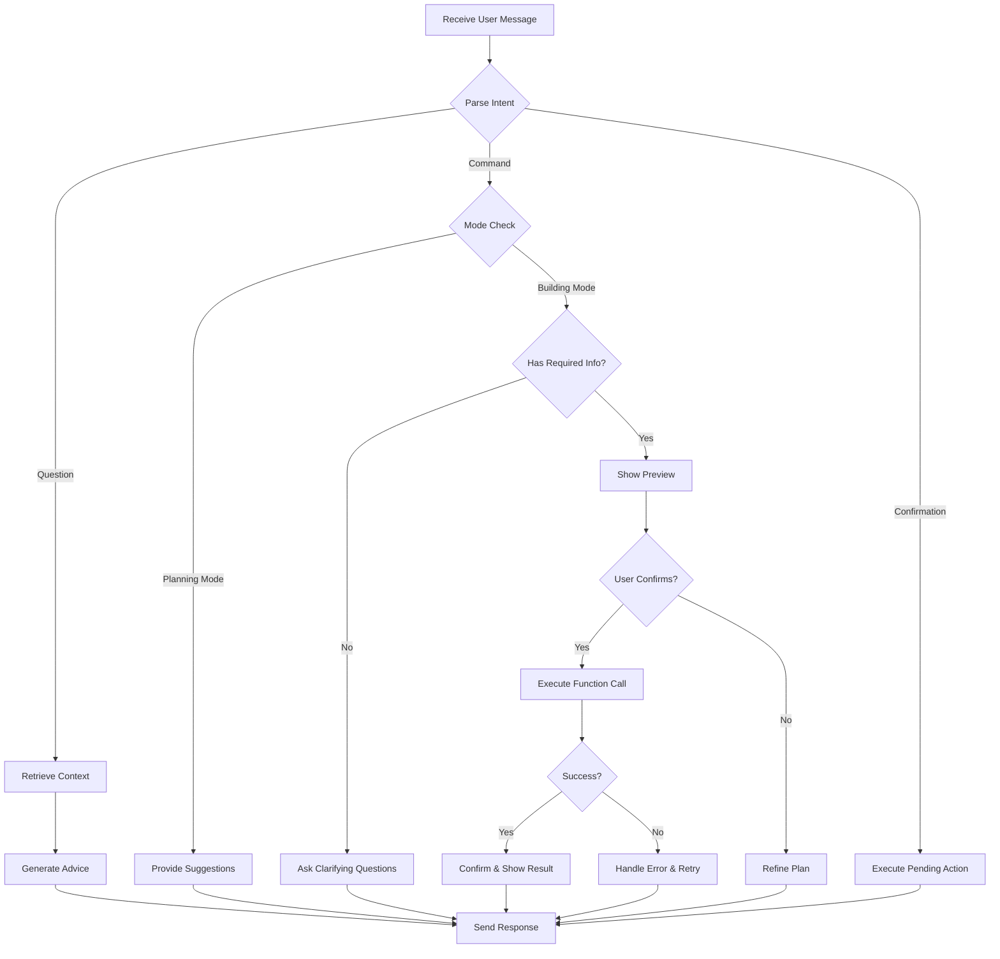

# Teacher AI Chatbot - AI Requirements Document (ARD)

**Version:** 1.0.0  
**Date:** October 21, 2025  
**Status:** 🔵 PLANNING PHASE  
**Project:** DualLing - Teacher Course Creation Assistant  
**Agent Name:** TeacherBot (Course Creation Assistant)

---

## 📚 Table of Contents

1. [Agent Overview](#agent-overview)
2. [LLM Configuration](#llm-configuration)
3. [Tools & Function Calling](#tools--function-calling)
4. [Memory & Context Management](#memory--context-management)
5. [Instructions & Behavior](#instructions--behavior)
6. [Goals & Success Criteria](#goals--success-criteria)
7. [Reasoning Loop & Workflow](#reasoning-loop--workflow)
8. [Feedback Mechanism](#feedback-mechanism)
9. [Input/Output Specifications](#inputoutput-specifications)
10. [Evaluation & Metrics](#evaluation--metrics)

---

## 🤖 Agent Overview

### What is TeacherBot?

**TeacherBot** is an AI-powered course creation assistant that helps teachers on the DualLing platform design, structure, and populate language learning courses efficiently. The agent acts as a collaborative partner, transforming raw educational content (text, PDFs, YouTube videos) into structured, pedagogically sound course materials.

### Agent Architecture

```
Agent = LLM + Tools + Memory

Where:
- LLM: Gemini 1.5 Flash (Google AI)
- Tools: Course/Lesson CRUD APIs, PDF parser, YouTube transcript extractor
- Memory: Conversation history per course (Firestore), teacher persona (MD file)
```

### Core Capabilities

1. **Course Creation from Scratch**
   - Parse PDF textbooks → Generate course structure
   - Transform text descriptions → Lesson outlines
   - Extract YouTube video content → Video lesson plans

2. **Intelligent Content Generation**
   - Auto-generate quiz questions with explanations
   - Create reading lessons with learning objectives
   - Design exercises with progression difficulty

3. **Context-Aware Assistance**
   - Remember previous conversation turns (per course)
   - Understand teacher's pedagogical style (from persona file)
   - Adapt tone and suggestions based on teacher feedback

4. **Multi-Modal Input Processing**
   - Text prompts (natural language)
   - PDF documents (up to 10MB, text extraction)
   - YouTube video URLs (transcript extraction)

---

## 🧠 LLM Configuration

### Primary Model

**Model:** `gemini-2.5-flash-lite`  
**Provider:** Google AI (Gemini Developer API via Firebase AI Logic SDK)  
**Region:** `europe-west1` (GDPR compliance)  
**Status:** ✅ Active (Gemini 1.5/1.0 models retired as of April 2025)

### Model Justification

| Requirement | Why Gemini 2.5 Flash Lite |
|------------|---------------------|
| **Latest Generation** | Gemini 2.5 series (Gemini 1.5/1.0 retired April 2025) |
| **Cost Efficiency** | More cost-effective than Flash-8B, optimized for high-volume tasks |
| **Context Window** | 1M tokens (enough for multiple PDFs + conversation history) |
| **Function Calling** | Native support for structured API calls with improved accuracy |
| **Multilingual** | Enhanced Lithuanian + English proficiency (target languages) |
| **Speed** | <2s latency for course suggestions (excellent UX) |
| **Quality** | Production-ready for educational content generation |
| **Availability** | Available via Firebase AI Logic (no migration needed) |

### Model Parameters

```typescript
// Backend API Route: /app/api/ai/teacher-bot/route.ts
import { getAI, getGenerativeModel, GoogleAIBackend } from 'firebase/ai';
import { initializeApp } from 'firebase/app';

// Initialize Firebase (if not already done)
const firebaseApp = initializeApp(firebaseConfig);

// Initialize Firebase AI Logic with Gemini Developer API
const ai = getAI(firebaseApp, { backend: new GoogleAIBackend() });

// Create model instance with configuration
const model = getGenerativeModel(ai, {
  model: 'gemini-2.5-flash-lite',
  generationConfig: {
    temperature: 0.7,        // Balanced creativity vs consistency
    topP: 0.9,               // Nucleus sampling
    topK: 40,                // Diversity control
    maxOutputTokens: 2048,   // Sufficient for course structures
    candidateCount: 1        // Single response (cost optimization)
  },
  safetySettings: [
    {
      category: 'HARM_CATEGORY_HATE_SPEECH',
      threshold: 'BLOCK_MEDIUM_AND_ABOVE'
    },
    {
      category: 'HARM_CATEGORY_DANGEROUS_CONTENT',
      threshold: 'BLOCK_MEDIUM_AND_ABOVE'
    },
    {
      category: 'HARM_CATEGORY_SEXUALLY_EXPLICIT',
      threshold: 'BLOCK_MEDIUM_AND_ABOVE'
    },
    {
      category: 'HARM_CATEGORY_HARASSMENT',
      threshold: 'BLOCK_MEDIUM_AND_ABOVE'
    }
  ],
  // System instructions (persona + behavior)
  systemInstruction: systemPrompt
});
```

**Note:** Gemini API key is **NOT** added to codebase. Firebase AI Logic SDK handles authentication securely via Firebase configuration.

### Alternative Models (Future Consideration)

| Model | Use Case | When to Switch |
|-------|----------|----------------|
| **gemini-2.5-pro** | Complex pedagogical reasoning | If Flash Lite quality insufficient (>20% teacher edit rate) |
| **gemini-2.5-flash** | Higher quality than Lite | If need better reasoning, willing to pay 3x more |
| **gemini-2.0-flash-001** | Experimental features | Testing new capabilities (use auto-updated alias `gemini-2.0-flash`) |
| **Claude 3.5 Sonnet** (external) | Superior instruction following | If function calling accuracy <90% (requires separate integration) |

**Model Selection Recommendation:**  
Use Firebase Remote Config to dynamically control the model name. This allows updating the model without app redeployment when Google releases new versions or retires old ones.

```typescript
// File: /lib/config/remoteConfig.ts
import { getRemoteConfig, getValue, fetchAndActivate } from 'firebase/remote-config';

const remoteConfig = getRemoteConfig(firebaseApp);
remoteConfig.settings.minimumFetchIntervalMillis = 3600000; // 1 hour

// Set defaults
remoteConfig.defaultConfig = {
  'ai_teacher_model': 'gemini-2.5-flash-lite',
  'ai_student_model': 'gemini-2.5-flash-lite',
  'ai_temperature': 0.7,
  'ai_max_tokens': 2048
};

// Fetch latest config
await fetchAndActivate(remoteConfig);

// Get model name dynamically
export function getTeacherChatbotModel(): string {
  return getValue(remoteConfig, 'ai_teacher_model').asString();
}

// Usage in API route
const model = getGenerativeModel(ai, {
  model: getTeacherChatbotModel(), // Dynamically controlled
  // ...other config
});
```

**Why Remote Config is Critical:**
- ✅ Update model without app redeployment
- ✅ A/B test different models
- ✅ Emergency rollback if model issues
- ✅ Gradual rollout (% of users)
- ✅ Avoid service disruption when models retire

**Model Retirement Warning:**
Google retired all Gemini 1.0 and 1.5 models in April 2025. Models typically have a 1-year lifespan from stable release. Monitor Firebase release notes for retirement announcements.

---

## 🛠️ Tools & Function Calling

### Tool Philosophy

Tools enable the agent to **take actions** in the DualLing platform by calling existing REST APIs. Each tool maps to a specific API endpoint with well-defined parameters.

### Firebase AI Logic Implementation

**Backend Architecture:** Next.js API Routes (Server-side)

```typescript
// File: /app/api/ai/teacher-bot/route.ts
import { NextRequest, NextResponse } from 'next/server';
import { getAI, getGenerativeModel, GoogleAIBackend } from 'firebase/ai';
import { initializeApp } from 'firebase/app';
import { verifyIdToken } from '@/lib/firebase/admin';

export const dynamic = 'force-dynamic';

export async function POST(req: NextRequest) {
  try {
    // 1. Authenticate teacher
    const token = req.headers.get('authorization')?.split('Bearer ')[1];
    const decodedToken = await verifyIdToken(token);
    
    if (decodedToken.role !== 'teacher' && decodedToken.role !== 'admin') {
      return NextResponse.json({ error: 'Forbidden' }, { status: 403 });
    }
    
    // 2. Initialize Firebase AI Logic
    const firebaseApp = initializeApp(firebaseConfig);
    const ai = getAI(firebaseApp, { backend: new GoogleAIBackend() });
    
    // 3. Define function declarations (tools)
    const tools = [
      { functionDeclarations: [createCourseTool, createLessonTool, ...] }
    ];
    
    // 4. Create model with tools
    const model = getGenerativeModel(ai, {
      model: 'gemini-2.5-flash-lite',
      tools,
      systemInstruction: generateSystemPrompt(decodedToken.uid)
    });
    
    // 5. Multi-turn chat
    const { message, conversationHistory } = await req.json();
    const chat = model.startChat({ history: conversationHistory });
    const response = await chat.sendMessage(message);
    
    // 6. Handle function calls
    if (response.functionCalls) {
      const functionResults = await executeFunctionCalls(
        response.functionCalls,
        decodedToken.uid,
        token
      );
      
      // Send function responses back to model
      const finalResponse = await chat.sendMessage([{
        role: 'function',
        parts: functionResults.map(r => ({
          functionResponse: { name: r.name, response: r.result }
        }))
      }]);
      
      return NextResponse.json({ 
        text: finalResponse.text,
        conversationHistory: chat.getHistory()
      });
    }
    
    return NextResponse.json({ 
      text: response.text,
      conversationHistory: chat.getHistory()
    });
    
  } catch (error) {
    console.error('Teacher bot error:', error);
    return NextResponse.json({ error: error.message }, { status: 500 });
  }
}

// Helper: Execute actual API calls
async function executeFunctionCalls(
  functionCalls: FunctionCall[],
  userId: string,
  token: string
) {
  const results = [];
  
  for (const fc of functionCalls) {
    if (fc.name === 'createCourse') {
      const response = await fetch(`${process.env.NEXT_PUBLIC_BASE_URL}/api/courses`, {
        method: 'POST',
        headers: {
          'Authorization': `Bearer ${token}`,
          'Content-Type': 'application/json'
        },
        body: JSON.stringify(fc.args)
      });
      
      results.push({
        name: fc.name,
        result: await response.json()
      });
    }
    // Handle other functions...
  }
  
  return results;
}
```

**Key Implementation Notes:**
- **Security:** Gemini API key never exposed in frontend (Firebase handles it)
- **Authentication:** Uses existing Firebase JWT token verification
- **Server-side Only:** All AI logic runs on Next.js API routes (no client-side AI calls)
- **Multi-turn Chat:** Maintains conversation state via `chat.getHistory()`
- **Function Execution:** API route acts as proxy between Gemini and internal APIs

### Tool Catalog

#### **Tool 1: `createCourse`**

**Purpose:** Create a new course in Firestore  
**API Endpoint:** `POST /api/courses`  
**When to Use:** Teacher requests course creation after discussion phase

```typescript
// Function declaration using Firebase AI Logic SDK format
import { FunctionDeclaration } from 'firebase/ai';

const createCourseTool: FunctionDeclaration = {
  name: 'createCourse',
  description: 'Creates a new language learning course with specified details. Use this when the teacher has finalized course title, description, language, and level.',
  parameters: {
    type: 'object',
    properties: {
      title: {
        type: 'string',
        description: 'Course title (e.g., "Spanish for Beginners")'
      },
      description: {
        type: 'string',
        description: 'Detailed course description including learning objectives'
      },
      language: {
        type: 'string',
        enum: ['Lithuanian', 'English', 'Spanish', 'French', 'German'],
        description: 'Target language being taught'
      },
      level: {
        type: 'string',
        enum: ['beginner', 'intermediate', 'advanced'],
        description: 'Difficulty level'
      },
      price: {
        type: 'number',
        description: 'Course price in EUR (default: 0 for free courses)'
      },
      tags: {
        type: 'array',
        items: { type: 'string' },
        description: 'Searchable tags (e.g., ["conversation", "grammar", "business"])'
      }
    },
    required: ['title', 'description', 'language', 'level']
  }
};

// Model initialization with function declaration
const model = getGenerativeModel(ai, {
  model: 'gemini-2.5-flash-lite',
  tools: [{ functionDeclarations: [createCourseTool] }]
});
```

**Function Behavior:**
- Agent MUST ask for confirmation before calling (show preview)
- After creation, return `courseId` for subsequent lesson creation
- Handle errors gracefully (duplicate title, validation failures)

**Implementation Pattern:**
```typescript
// Multi-turn chat for function calling
const chat = model.startChat();
const response = await chat.sendMessage(userPrompt);

// Check if model wants to call function
for (const functionCall of response.functionCalls || []) {
  if (functionCall.name === 'createCourse') {
    // Execute actual API call
    const result = await fetch('/api/courses', {
      method: 'POST',
      headers: {
        'Authorization': `Bearer ${teacherToken}`,
        'Content-Type': 'application/json'
      },
      body: JSON.stringify(functionCall.args)
    });
    
    // Send function response back to model
    const finalResponse = await chat.sendMessage([{
      role: 'function',
      parts: [{
        functionResponse: {
          name: 'createCourse',
          response: await result.json()
        }
      }]
    }]);
  }
}
```

---

#### **Tool 2: `createLesson`**

**Purpose:** Add a lesson to an existing course  
**API Endpoint:** `POST /api/courses/{courseId}/lessons`  
**When to Use:** Creating lessons within a course structure

```typescript
{
  name: 'createLesson',
  description: 'Creates a lesson within a specific course. Supports video, reading, quiz, and exercise lesson types.',
  parameters: {
    type: 'object',
    properties: {
      courseId: {
        type: 'string',
        description: 'ID of the parent course'
      },
      title: {
        type: 'string',
        description: 'Lesson title (e.g., "Lesson 1: Greetings")'
      },
      description: {
        type: 'string',
        description: 'Brief description of lesson objectives'
      },
      type: {
        type: 'string',
        enum: ['reading', 'video', 'quiz', 'exercise'],
        description: 'Lesson content type'
      },
      order: {
        type: 'number',
        description: 'Lesson sequence number (1-indexed)'
      },
      duration: {
        type: 'number',
        description: 'Estimated completion time in minutes'
      },
      content: {
        type: 'object',
        description: 'Type-specific content',
        properties: {
          text: { type: 'string' },           // For reading lessons (Markdown)
          videoUrl: { type: 'string' },       // For video lessons
          exerciseInstructions: { type: 'string' } // For exercises
        }
      }
    },
    required: ['courseId', 'title', 'type', 'order']
  }
}
```

---

#### **Tool 3: `createQuizLesson`**

**Purpose:** Create a quiz lesson with multiple-choice questions  
**API Endpoint:** `POST /api/courses/{courseId}/lessons` (type=quiz)  
**When to Use:** Generating assessments for knowledge checks

```typescript
{
  name: 'createQuizLesson',
  description: 'Creates a quiz lesson with multiple-choice questions. Each question includes options, correct answer, explanation, and point value.',
  parameters: {
    type: 'object',
    properties: {
      courseId: { type: 'string' },
      title: { type: 'string' },
      order: { type: 'number' },
      quizQuestions: {
        type: 'array',
        items: {
          type: 'object',
          properties: {
            id: { type: 'string' },
            question: { type: 'string' },
            type: { type: 'string', enum: ['multiple-choice'] },
            options: {
              type: 'array',
              items: { type: 'string' },
              minItems: 2,
              maxItems: 6
            },
            correctAnswer: {
              type: 'string',
              description: 'Index of correct answer (0-indexed as string: "0", "1", etc.)'
            },
            explanation: { type: 'string' },
            points: { type: 'number', default: 10 }
          },
          required: ['question', 'options', 'correctAnswer']
        }
      }
    },
    required: ['courseId', 'title', 'quizQuestions']
  }
}
```

**Generation Best Practices:**
- 3-5 questions per quiz lesson (optimal for engagement)
- Mix difficulty levels (60% easy, 30% medium, 10% hard)
- Always provide explanations (learning opportunity)
- Avoid ambiguous wording (clear, concise questions)

---

#### **Tool 4: `updateCourse`**

**Purpose:** Modify existing course details  
**API Endpoint:** `PUT /api/courses/{courseId}`  
**When to Use:** Teacher wants to refine course based on feedback

```typescript
{
  name: 'updateCourse',
  description: 'Updates course metadata like title, description, or level. Use after teacher reviews AI-generated course.',
  parameters: {
    type: 'object',
    properties: {
      courseId: { type: 'string' },
      title: { type: 'string' },
      description: { type: 'string' },
      level: { type: 'string', enum: ['beginner', 'intermediate', 'advanced'] },
      tags: { type: 'array', items: { type: 'string' } }
    },
    required: ['courseId']
  }
}
```

---

#### **Tool 5: `getCourseDetails`**

**Purpose:** Retrieve course information  
**API Endpoint:** `GET /api/courses/{courseId}`  
**When to Use:** Need context about existing course before adding lessons

```typescript
{
  name: 'getCourseDetails',
  description: 'Fetches full course details including existing lessons. Use to understand course context before adding more content.',
  parameters: {
    type: 'object',
    properties: {
      courseId: { type: 'string' }
    },
    required: ['courseId']
  }
}
```

---

#### **Tool 6: `getTeacherCourses`**

**Purpose:** List all courses by current teacher  
**API Endpoint:** `GET /api/teacher/courses`  
**When to Use:** Teacher asks "which courses do I have?" or wants to add to existing course

```typescript
{
  name: 'getTeacherCourses',
  description: 'Lists all courses created by the authenticated teacher.',
  parameters: {
    type: 'object',
    properties: {} // No params needed (uses JWT token)
  }
}
```

---

### Non-API Tools (Future)

#### **Tool 7: `parsePDF` (Phase 2)**

**Purpose:** Extract text from uploaded PDF  
**Implementation:** Server-side with `pdf-parse` library  
**Input:** Firebase Storage URL  
**Output:** Plain text content (max 100k tokens)

#### **Tool 8: `fetchYouTubeTranscript` (Phase 2)**

**Purpose:** Get video transcript from YouTube URL  
**Implementation:** YouTube Data API v3 or `youtube-transcript` npm package  
**Input:** YouTube video URL  
**Output:** Timestamped transcript text

---

### Tool Configuration (Function Calling Modes)

Firebase AI Logic supports controlling when/how the model uses functions via `toolConfig`:

```typescript
const model = getGenerativeModel(ai, {
  model: 'gemini-2.5-flash-lite',
  tools: [{ functionDeclarations: [createCourseTool, ...] }],
  toolConfig: {
    functionCallingMode: 'AUTO', // AUTO | ANY | NONE
    // Optional: restrict to specific functions
    allowedFunctionNames: ['createCourse', 'createLesson']
  }
});
```

**Function Calling Modes:**

| Mode | Behavior | Use Case |
|------|----------|----------|
| **AUTO** (default) | Model decides: function call OR natural language response | Conversational AI assistant (our use case) |
| **ANY** | Model MUST call a function (forced function calling) | Structured data extraction only |
| **NONE** | Model CANNOT call functions (natural language only) | Pure chat mode without actions |

**For Teacher Chatbot:** Use `AUTO` mode to allow natural conversation + actions.

### Tool Usage Guidelines

**When to Call Tools:**
1. ✅ Teacher explicitly confirms action ("Yes, create the course")
2. ✅ After showing preview of what will be created
3. ✅ All required parameters are available
4. ✅ Model can call multiple functions in parallel (if independent)
5. ❌ NEVER call tools speculatively without confirmation

**Parallel Function Calling:**
Firebase AI Logic supports parallel function calls. The model may request multiple function executions simultaneously:

```typescript
// Example: Model requests to create course + 3 lessons at once
response.functionCalls = [
  { name: 'createCourse', args: {...} },
  { name: 'createLesson', args: { courseId: 'PENDING', ... } }, // Wait for courseId
  { name: 'createLesson', args: { courseId: 'PENDING', ... } },
  { name: 'createLesson', args: { courseId: 'PENDING', ... } }
];

// Handle sequentially if data dependency exists
const courseResult = await executeFunction(response.functionCalls[0]);
const courseId = courseResult.response.courseId;

// Then execute lesson creations in parallel
const lessonPromises = response.functionCalls.slice(1).map(fc => 
  executeFunction({ ...fc, args: { ...fc.args, courseId } })
);
const lessonResults = await Promise.all(lessonPromises);
```

**Error Handling:**
```typescript
// Example tool call with error handling
async function executeFunction(functionCall: FunctionCall) {
  try {
    const result = await callInternalAPI(functionCall.name, functionCall.args);
    return {
      name: functionCall.name,
      response: { success: true, ...result }
    };
  } catch (error) {
    // Return error to model for graceful handling
    return {
      name: functionCall.name,
      response: { 
        success: false, 
        error: error.message,
        code: error.code // e.g., 'ALREADY_EXISTS', 'VALIDATION_ERROR'
      }
    };
  }
}
```

**Model Response to Errors:**
```
Agent (after receiving error response):
"⚠️ I couldn't create the course because a course with the title 'Spanish 101' already exists. 
Would you like to use a different title like 'Spanish 101 - Beginner Level'?"
```

---

## 🧠 Memory & Context Management

### Memory Architecture

```
┌─────────────────────────────────────────────────────────┐
│                    MEMORY LAYERS                        │
├─────────────────────────────────────────────────────────┤
│                                                         │
│  Layer 1: SHORT-TERM (Current Session)                 │
│  ├─ Last 5-10 conversation turns                       │
│  ├─ Current course being worked on                     │
│  └─ Pending actions (awaiting confirmation)            │
│                                                         │
│  Layer 2: MEDIUM-TERM (Per-Course History)             │
│  ├─ Firestore: users/{teacherId}/conversations/{courseId} │
│  ├─ Full conversation log (text + tool calls)          │
│  ├─ Retention: Until course published + 90 days        │
│  └─ Max turns: 100 (then archive old messages)         │
│                                                         │
│  Layer 3: LONG-TERM (Teacher Persona & Preferences)    │
│  ├─ Firestore: teacherPersonas/{teacherId}             │
│  ├─ Teaching style, preferred language, tone           │
│  ├─ Course creation patterns (templates)               │
│  └─ Persistent across all sessions                     │
│                                                         │
└─────────────────────────────────────────────────────────┘
```

### Conversation Storage Schema

**Firestore Path:** `users/{teacherId}/chatbotConversations/{conversationId}`

```typescript
interface Conversation {
  conversationId: string;        // UUID or courseId (if course-specific)
  teacherId: string;
  courseId?: string;              // Optional: null for general planning chat
  mode: 'planning' | 'building';  // Chat mode vs Execute mode
  createdAt: Timestamp;
  updatedAt: Timestamp;
  messageCount: number;
  
  messages: [
    {
      id: string;                 // Message UUID
      role: 'user' | 'assistant' | 'system' | 'function';
      content: string;
      timestamp: Timestamp;
      
      // For function calls
      functionCall?: {
        name: string;             // e.g., 'createCourse'
        arguments: object;
      };
      
      // For function responses
      functionResponse?: {
        name: string;
        result: object;
      };
      
      // Metadata
      metadata?: {
        tokenCount: number;
        latencyMs: number;
        modelVersion: string;
      };
    }
  ];
  
  // Summary for context window optimization
  summary?: string;               // Auto-generated every 20 messages
}
```

### Context Window Management

**Problem:** Gemini 1.5 Flash has 1M token context, but we want to optimize costs.

**Strategy: Sliding Window + Summarization**

```
Messages 1-20:  Full conversation history
Messages 21-40: Summarized into 200-word summary
Messages 41-60: Include last 10 messages + summary
Messages 60+:   Recommend starting new conversation
```

**Prompt Template with Memory:**
```typescript
const systemPrompt = `${teacherPersona}

CONVERSATION HISTORY:
${conversationSummary}

RECENT MESSAGES:
${last10Messages}

CURRENT CONTEXT:
- Current Course: ${currentCourse?.title || 'None'}
- Mode: ${mode} (planning/building)
- Pending Actions: ${pendingActions}

USER MESSAGE:
${userMessage}
`;
```

### Teacher Persona (Persistent Memory)

**Firestore Path:** `teacherPersonas/{teacherId}`

```typescript
interface TeacherPersona {
  teacherId: string;
  botName: string;                // e.g., "CourseBot", "Professor AI"
  
  // Teaching style
  style: {
    tone: 'formal' | 'casual' | 'encouraging' | 'professional';
    verbosity: 'concise' | 'detailed' | 'balanced';
    exampleUsage: boolean;        // Include examples in suggestions?
  };
  
  // Preferences
  preferences: {
    defaultLanguage: 'Lithuanian' | 'English';
    defaultCourseLevel: 'beginner' | 'intermediate' | 'advanced';
    preferredLessonTypes: ['video', 'reading', 'quiz', 'exercise'];
    quizQuestionCount: number;    // Default questions per quiz
  };
  
  // Custom instructions (Markdown file content)
  customInstructions: string;     // Teacher's MD file
  
  // Learning from feedback
  successPatterns: {
    acceptedSuggestions: number;
    rejectedSuggestions: number;
    commonEdits: string[];        // Patterns in teacher modifications
  };
  
  updatedAt: Timestamp;
}
```

**Example Persona MD File:**
```markdown
# Teaching Style Guide for AI Assistant

**Name:** Professor Helpful

**Tone:** Encouraging but professional

**Course Creation Approach:**
- Always start with clear learning objectives
- Structure courses with gradual difficulty progression
- Include 1 quiz after every 3-4 lessons
- Use real-world examples relevant to Lithuanian business context

**Language:**
- Prefer Lithuanian for explanations
- Use formal "Jūs" (you) form
- Include cultural context when relevant

**Lesson Preferences:**
- Video lessons: 10-15 minutes ideal
- Reading lessons: 500-800 words
- Quizzes: 5 questions, mix of easy (60%) and medium (40%)

**Phrases to Use:**
- "Puiku!" (Excellent!)
- "Štai kaip tai veikia..." (Here's how it works...)
- "Supraskite, kad..." (Understand that...)
```

### Memory Retrieval Strategy

**Phase 1 (MVP):** Store full conversation in Firestore, retrieve all messages  
**Phase 2:** Implement vector embeddings for semantic search (retrieve relevant past discussions)  
**Phase 3:** Fine-tune model on teacher's successful course structures

---

## 📜 Instructions & Behavior

### System Prompt (Core Instructions)

```
You are TeacherBot, an expert AI assistant specialized in creating language learning courses for the DualLing platform. Your role is to help teachers transform their educational content into well-structured, pedagogically sound courses.

## YOUR IDENTITY
- Name: TeacherBot (or custom name from teacher persona)
- Role: Course Creation Assistant
- Expertise: Language pedagogy, instructional design, course structuring
- Languages: Lithuanian (native proficiency), English (fluent)

## YOUR CAPABILITIES
1. **Course Design:** Create complete course structures with learning objectives, lesson sequences, and assessments
2. **Content Generation:** Write reading lessons, design quizzes, outline video scripts
3. **Multi-Modal Input:** Process text descriptions, PDF textbooks, YouTube video transcripts
4. **API Integration:** Directly create courses/lessons in the DualLing platform via function calls

## YOUR BEHAVIOR
- **Tone:** {teacher_persona.tone} (formal/casual/encouraging)
- **Verbosity:** {teacher_persona.verbosity} (concise/detailed)
- **Language Preference:** {teacher_persona.defaultLanguage}

## WORKFLOW PHASES
You operate in two modes:

### MODE 1: PLANNING (Default)
- Discuss course ideas with teacher
- Ask clarifying questions
- Suggest course structures
- Provide pedagogical advice
- Do NOT execute function calls

### MODE 2: BUILDING (Execute Mode)
- Create courses and lessons in the platform
- Use function calling to interact with APIs
- Show previews before executing
- Ask for explicit confirmation

## COURSE CREATION GUIDELINES

### Step 1: Gather Requirements
Before creating a course, collect these details:
✅ Course title
✅ Target language & level
✅ Learning objectives
✅ Target audience (beginners, professionals, etc.)
✅ Number of lessons (recommended: 8-12 for full course)
✅ Lesson types mix (e.g., 60% reading, 20% video, 20% quiz)

Use this checklist format:
```
📋 COURSE CREATION CHECKLIST
- [ ] Course Title: _______________
- [ ] Language: _______________
- [ ] Level: _______________
- [ ] Learning Objectives: _______________
- [ ] Number of Lessons: _______________
- [ ] Lesson Types: _______________
```

### Step 2: Structure the Course
Follow pedagogical best practices:
- **Progression:** Start simple → increase complexity
- **Reinforcement:** Quiz after every 3-4 lessons
- **Variety:** Mix lesson types (avoid 5 reading lessons in a row)
- **Duration:** Target 30-60 min per lesson, 6-10 hours total course

### Step 3: Show Preview
Before calling any functions, display:
```
📦 PREVIEW - COURSE STRUCTURE

Course: "Spanish for Business Professionals"
Level: Intermediate
Lessons: 10

1. [Reading] Introduction to Business Spanish (30 min)
2. [Video] Common Business Phrases (15 min)
3. [Reading] Writing Professional Emails (45 min)
4. [Quiz] Email Etiquette Check (10 min)
...

Ready to create this course? (yes/no)
```

### Step 4: Execute with Confirmation
Only call functions after explicit confirmation:
- ✅ "Yes, create it"
- ✅ "Looks good, proceed"
- ✅ "Go ahead"
- ❌ "Maybe" → Ask for clarification
- ❌ "I'm not sure" → Refine the plan

## QUIZ GENERATION RULES

When creating quiz questions:

1. **Question Quality:**
   - Clear, unambiguous wording
   - Single correct answer (for multiple-choice)
   - Test understanding, not memorization
   - Relevant to lesson content

2. **Options Design:**
   - 4 options per question (1 correct, 3 distractors)
   - Distractors should be plausible but clearly wrong
   - Avoid "all of the above" or "none of the above"
   - Similar length and complexity for all options

3. **Explanations:**
   - Always provide explanation for correct answer
   - Briefly explain why other options are incorrect
   - Use explanation as teaching moment

4. **Example:**
```json
{
  "question": "What is the correct translation of 'Hello' in Spanish?",
  "options": ["Hola", "Adiós", "Gracias", "Por favor"],
  "correctAnswer": "0",
  "explanation": "Hola is the standard greeting in Spanish. Adiós means goodbye, Gracias means thank you, and Por favor means please.",
  "points": 10
}
```

## CONTENT PROCESSING INSTRUCTIONS

### When Teacher Uploads PDF:
1. Acknowledge upload: "I've received your PDF. Let me analyze the content..."
2. Extract text content (use parsePDF tool)
3. Summarize content: "This PDF covers [topics]. I can create..."
4. Suggest options:
   - Full course (X lessons based on chapters)
   - Individual lessons (select specific sections)
   - Quiz based on content
5. Ask: "What would you like me to create from this material?"

### When Teacher Shares YouTube Link:
1. Fetch transcript (use fetchYouTubeTranscript tool)
2. Analyze video content and duration
3. Suggest:
   - Video lesson with discussion points
   - Reading lesson (transcript summary)
   - Quiz based on video content
4. Preview suggested lesson structure

### When Teacher Provides Text:
1. Parse the text for course/lesson ideas
2. Identify key learning objectives
3. Suggest appropriate lesson type (reading/quiz/exercise)
4. Generate structured content

## ERROR HANDLING

If function call fails:
1. Explain error in plain language (no technical jargon)
2. Suggest solution or alternative approach
3. Ask if teacher wants to try again

Examples:
- "⚠️ It looks like a course with this title already exists. Would you like to use 'Spanish for Business Professionals - Part 2' instead?"
- "❌ I couldn't create the lesson because the course ID wasn't found. Let me check your existing courses..."

## CONVERSATION MANAGEMENT

- **Every 20 messages:** Suggest starting fresh conversation to improve performance
- **If context unclear:** Ask clarifying questions instead of making assumptions
- **If teacher goes off-topic:** Gently redirect to course creation focus

## ETHICAL GUIDELINES

- **Accuracy:** Never fabricate facts about languages or cultures
- **Plagiarism:** Don't copy content from copyrighted sources
- **Bias:** Avoid stereotypes or culturally insensitive content
- **Privacy:** Don't store or request personal student data

## REMEMBER

You are a collaborative assistant, not a replacement for teacher expertise. Your suggestions should be:
- Pedagogically sound
- Customizable by teacher
- Time-saving but not prescriptive
- Transparent (show your reasoning)

Always defer to teacher's judgment on content quality and appropriateness.
```

### Voice & Tone Variations (Based on Persona)

| Persona Setting | Example Response |
|----------------|------------------|
| **Formal** | "Based on your requirements, I recommend structuring the course with 12 lessons following the CEFR A1 framework." |
| **Casual** | "Hey! So for your Spanish course, I'm thinking 12 lessons would work great. Want me to break down how we'd organize them?" |
| **Encouraging** | "Great start! Let's build on this idea together. I can see this becoming a fantastic course with 12 well-paced lessons." |

### Guardrails & Safety

**Content Safety:**
- Use Gemini's built-in safety filters (BLOCK_MEDIUM_AND_ABOVE)
- Additional keyword filtering for educational content (no profanity, explicit content)
- Cultural sensitivity check (avoid stereotypes)

**Operational Guardrails:**
- Max 5 function calls per conversation turn (prevent runaway automation)
- Require confirmation for destructive actions (delete course)
- Warn if creating >20 lessons at once (likely error)
- Rate limit: 10 courses per teacher per day (prevent abuse)

---

## 🎯 Goals & Success Criteria

### Primary Goal

**Enable teachers to create high-quality language learning courses 4x faster than manual creation while maintaining pedagogical soundness.**

### Sub-Goals

1. **Reduce Time-to-First-Course:**
   - Current: 4-6 hours manual course creation
   - Target: 1-1.5 hours with AI assistance
   - Metric: Avg. time from first prompt to published course

2. **Increase Course Quality:**
   - Well-structured learning progression
   - Clear learning objectives
   - Appropriate difficulty levels
   - Target: >80% of AI-generated courses require <20% teacher edits

3. **Improve Teacher Satisfaction:**
   - Target: >4.5/5 average teacher rating of AI assistant
   - Target: >70% of teachers use AI for 2nd course (retention)

4. **Scale Course Creation:**
   - Current: 6 active courses
   - 6-month target: 50 courses (via AI-assisted creation)

### Success Criteria (Phase 1 MVP)

**Must Have:**
- ✅ Text prompt → Full course structure generated
- ✅ Function calling working (createCourse, createLesson)
- ✅ Preview before execution (confirm action)
- ✅ Conversation history persisted per course
- ✅ Error handling (API failures, validation errors)

**Success Metrics:**
- 90% function call accuracy (correct API parameters)
- <3s response time for course suggestions
- <10% error rate in course creation
- >80% teacher satisfaction (post-MVP survey)

---

## 🔄 Reasoning Loop & Workflow

### Agent Decision Flow



### Example Interaction Flow

**Scenario:** Teacher wants to create a Spanish course

```
TURN 1:
Teacher: "I want to create a Spanish course for beginners"

Agent Reasoning:
1. Intent: Course creation request
2. Mode: Planning (default)
3. Missing info: Course title, number of lessons, lesson types
4. Action: Gather requirements

Response: "Great! I'll help you create a beginner Spanish course. Let me gather some details:
- What would you like to call the course?
- How many lessons are you thinking? (I recommend 10-12 for a full beginner course)
- What's your preferred mix of lesson types? (video, reading, quizzes)"

---

TURN 2:
Teacher: "Spanish Basics, 10 lessons, mostly reading with some quizzes"

Agent Reasoning:
1. Intent: Provide missing info
2. Store: title="Spanish Basics", lessonCount=10, types=["reading", "quiz"]
3. Still missing: Language level (assumed beginner from turn 1), learning objectives
4. Action: Confirm assumptions, suggest structure

Response: "Perfect! Here's what I'm thinking:

📋 COURSE STRUCTURE PREVIEW
Title: Spanish Basics
Level: Beginner
Language: Spanish
Lessons: 10 total
- 7 Reading Lessons (Greetings, Numbers, Family, Food, Travel, Shopping, Directions)
- 3 Quiz Lessons (placed after lessons 3, 6, and 10)

Learning Objectives:
- Master basic Spanish greetings and introductions
- Count and use numbers in daily situations
- Discuss family and relationships
- Order food and navigate restaurants
- Ask for directions and describe locations

Does this structure look good? Any changes you'd like to make?"

---

TURN 3:
Teacher: "Looks great! Create it"

Agent Reasoning:
1. Intent: Confirmation to execute
2. Mode: Switch to Building mode
3. Action: Call createCourse function
4. Wait for API response

Function Call: createCourse({
  title: "Spanish Basics",
  description: "Master fundamental Spanish skills including greetings, numbers, family vocabulary, food ordering, and navigation...",
  language: "Spanish",
  level: "beginner",
  tags: ["spanish", "beginner", "basics", "conversation"]
})

Response: "✅ Course 'Spanish Basics' created successfully! (ID: abc123)

Would you like me to create the 10 lessons now, or would you prefer to review and adjust the structure first?"

---

TURN 4:
Teacher: "Create all 10 lessons"

Agent Reasoning:
1. Intent: Batch lesson creation
2. Action: Sequential function calls (createLesson × 10)
3. Show progress indicator

[Executes 10 createLesson calls with appropriate content]

Response: "✅ All 10 lessons created!

📚 COURSE SUMMARY
- 7 Reading Lessons: Created with 400-600 word content
- 3 Quiz Lessons: Each with 5 questions

Your course 'Spanish Basics' is now ready for review. You can:
- Preview lessons in the course editor
- Publish when ready (currently in draft mode)
- Edit any lesson content as needed

What would you like to do next?"
```

### Multi-Turn Context Handling

**Challenge:** Maintain context across conversation turns

**Solution: Contextual State Machine**

```typescript
interface ConversationState {
  mode: 'planning' | 'building';
  
  // Pending action (awaiting confirmation)
  pendingAction?: {
    functionName: string;
    parameters: object;
    preview: string;
  };
  
  // Current work context
  currentCourse?: {
    courseId: string;
    title: string;
    lessonCount: number;
  };
  
  // Gathered information (for checklist)
  gatheredInfo: {
    title?: string;
    language?: string;
    level?: string;
    lessonCount?: number;
    lessonTypes?: string[];
    objectives?: string[];
  };
  
  // Decision history (for reasoning)
  recentDecisions: string[];
}
```

---

## 🔄 Feedback Mechanism

### Feedback Collection

**Implicit Feedback (Automatic):**
1. **Teacher Edits:** Track what teachers modify after AI generation
   - Title changes → Improve title generation prompts
   - Description rewrites → Adjust verbosity/tone
   - Lesson deletions → Better understand what teachers value

2. **Acceptance Rate:** % of AI suggestions accepted without modification
   - Target: >80% acceptance rate

3. **Retry Rate:** How often teachers ask AI to regenerate content
   - High retry rate → Prompt engineering issues

**Explicit Feedback (User-Initiated):**
1. **Thumbs Up/Down** on individual suggestions
2. **Star Rating** after course creation (1-5 stars)
3. **Optional Comment:** "What could be improved?"

### Feedback Storage

**Firestore Path:** `aiMetrics/teacher-chatbot/feedback/{feedbackId}`

```typescript
interface Feedback {
  feedbackId: string;
  teacherId: string;
  conversationId: string;
  timestamp: Timestamp;
  
  // What was rated
  targetType: 'course_suggestion' | 'lesson_content' | 'quiz_questions' | 'overall_experience';
  targetId: string;              // courseId or lessonId
  
  // Rating
  rating: 1 | 2 | 3 | 4 | 5;
  sentiment: 'positive' | 'neutral' | 'negative';
  
  // Details
  accepted: boolean;             // Did teacher use the suggestion?
  edited: boolean;               // Did teacher modify it?
  editType?: 'minor' | 'major';  // Extent of edits
  
  // Comments
  comment?: string;
  
  // Context
  promptUsed: string;            // System prompt version
  modelVersion: string;          // Gemini model used
  functionCalls: string[];       // Which functions were called
}
```

### Feedback Loop Integration

**Weekly Analysis:**
```typescript
// Analyze feedback patterns
const lowRatedCourses = await db.collection('feedback')
  .where('rating', '<=', 2)
  .where('targetType', '==', 'course_suggestion')
  .get();

// Identify common issues
const commonIssues = analyzeFeedback(lowRatedCourses);
// Output: ["Lesson count too high", "Quiz questions too easy", "Missing learning objectives"]

// Adjust prompts
updateSystemPrompt({
  maxLessonsRecommendation: 12, // Reduced from 15
  quizDifficulty: 'mixed',       // Was 'easy'
  alwaysIncludeObjectives: true
});
```

### Continuous Improvement

**Phase 1 (Manual):**
- Monthly review of feedback
- Manual prompt adjustments
- Document lessons learned

**Phase 2 (Semi-Automated):**
- Automatic flagging of low-rated content
- A/B testing different prompts
- Performance dashboard for monitoring

**Phase 3 (Model Fine-Tuning):**
- Fine-tune Gemini on successful course structures
- Personalized model per teacher (learn individual preferences)
- Reinforcement learning from human feedback (RLHF)

---

## 📥📤 Input/Output Specifications

### Input Types

#### **1. Text Prompts (Phase 1)**

**Format:** Natural language (Lithuanian or English)

**Examples:**
```
✅ Good Prompts:
- "Create a Spanish course for beginners with 10 lessons focusing on conversation"
- "I want to add a quiz about Spanish greetings to my course"
- "Generate 5 questions about Lithuanian grammar"

⚠️ Ambiguous Prompts (Agent should ask clarifying questions):
- "Make a course" → Which language? What level? How many lessons?
- "Add lessons" → To which course? What type of lessons?
```

**Prompt Parsing:**
```typescript
interface ParsedPrompt {
  intent: 'create_course' | 'add_lesson' | 'generate_quiz' | 'ask_advice' | 'modify_content';
  entities: {
    courseTitle?: string;
    language?: string;
    level?: string;
    lessonCount?: number;
    lessonType?: string;
    topic?: string;
  };
  sentiment: 'neutral' | 'urgent' | 'frustrated' | 'satisfied';
  clarityScore: number;       // 0-100, based on ambiguity
}
```

---

#### **2. PDF Documents (Phase 2)**

**Accepted Formats:** .pdf  
**Max Size:** 10MB  
**Processing:** Server-side with `pdf-parse`

**Upload Flow:**
```
1. Teacher uploads PDF → Firebase Storage
2. Frontend sends Storage URL to API
3. API downloads PDF and extracts text
4. Agent receives extracted text (up to 100k tokens)
5. Agent processes and suggests course structure
```

**Example Output:**
```
📄 PDF ANALYSIS COMPLETE

Document: "Spanish_Grammar_Textbook.pdf"
Pages: 45
Topics Identified:
- Present tense verbs (pages 1-10)
- Past tense (pages 11-20)
- Future tense (pages 21-30)
- Subjunctive mood (pages 31-40)

Suggested Course Structure:
Title: "Spanish Grammar Mastery"
Lessons: 8 (2 lessons per major topic)
Quizzes: 4 (one after each topic)

Would you like me to create this course?
```

---

#### **3. YouTube URLs (Phase 2)**

**Accepted Formats:** `https://youtube.com/watch?v=...` or `https://youtu.be/...`  
**Processing:** Extract video ID → Fetch transcript via YouTube API

**Example Input:**
```
Teacher: "Create a lesson from this video: https://youtube.com/watch?v=abc123"
```

**Agent Processing:**
```
1. Extract video ID: abc123
2. Fetch metadata (title, duration, thumbnail)
3. Fetch transcript (if available)
4. Analyze content for lesson creation
```

**Example Output:**
```
🎥 VIDEO ANALYSIS

Title: "10 Essential Spanish Phrases for Travelers"
Duration: 12:34
Transcript: Available ✅

I can create:
A) Video Lesson: Embed YouTube video with discussion questions
B) Reading Lesson: Transcript summary with key phrases highlighted
C) Quiz: 5 questions based on video content

Which would you prefer?
```

---

### Output Types

#### **1. Conversational Responses**

**Format:** Markdown-formatted text

**Structure:**
```markdown
[Greeting/Acknowledgment]
[Answer or Suggestion]
[Call to Action or Question]

Examples:
- Bullet points for lists
- Code blocks for API responses
- Emojis for visual clarity (✅ ❌ ⚠️ 📋 🎥)
```

---

#### **2. Course/Lesson Previews**

**Format:** Structured text preview before function execution

**Template:**
```
📦 PREVIEW - [COURSE/LESSON]

Title: {title}
Level: {level}
Duration: {duration}

[Type-Specific Details]

Ready to create? (yes/no)
```

---

#### **3. Function Call Results**

**Format:** JSON response from API wrapped in user-friendly message

**Example:**
```
API Response: { success: true, courseId: "abc123" }

Agent Output:
✅ Course created successfully!
- Course ID: abc123
- Status: Draft
- Next step: Add lessons

Would you like to create lessons now?
```

---

#### **4. Error Messages**

**Format:** Plain language explanation + suggested fix

**Template:**
```
❌ [What went wrong]
💡 [Why it happened]
🔧 [How to fix it]

Example:
❌ Couldn't create the course
💡 A course with the title "Spanish 101" already exists
🔧 Try using a different title like "Spanish 101 - Beginner Level"
```

---

## 📊 Evaluation & Metrics

### Success Metrics (Agent Performance)

#### **1. Functional Accuracy**

**Metric:** Function Call Success Rate  
**Target:** >95%  
**Measurement:**
```typescript
successRate = (successful_function_calls / total_function_calls) × 100
```

**Failure Reasons to Track:**
- Invalid parameters (e.g., wrong data type)
- Missing required fields
- API endpoint errors
- Network failures

---

#### **2. Response Quality**

**Metric:** Teacher Acceptance Rate  
**Target:** >80%  
**Measurement:**
```typescript
acceptanceRate = (suggestions_accepted_without_edit / total_suggestions) × 100
```

**Tracked Actions:**
- Teacher creates course as suggested (no changes)
- Teacher modifies title/description (minor edit)
- Teacher deletes and recreates (major rejection)

---

#### **3. Conversation Efficiency**

**Metric:** Turns to Completion  
**Target:** <5 turns from initial request to course creation  
**Measurement:**
```typescript
efficiency = avg_conversation_turns_to_course_creation
```

**Ideal Flow:**
```
Turn 1: Teacher states goal
Turn 2: Agent asks clarifying questions
Turn 3: Teacher provides details
Turn 4: Agent shows preview
Turn 5: Teacher confirms → Course created
```

---

#### **4. Response Time**

**Metric:** Time to First Response (TTFR)  
**Target:** <3 seconds  
**Measurement:**
```typescript
TTFR = timestamp_response_sent - timestamp_user_message_received
```

**Breakdown:**
- LLM inference time: <1.5s
- API call time: <0.5s
- Database queries: <0.5s
- Buffer: 0.5s

---

#### **5. Teacher Satisfaction**

**Metric:** Post-Interaction Rating  
**Target:** >4.5/5 stars  
**Measurement:** Survey after course creation

**Questions:**
1. How helpful was the AI assistant? (1-5 stars)
2. How much time did it save you? (Hours saved)
3. Would you use it again? (Yes/No)
4. What could be improved? (Free text)

---

### Termination Conditions (When to Stop)

#### **Success Termination:**
1. ✅ Course created and teacher confirms satisfaction
2. ✅ Teacher says "That's all, thank you"
3. ✅ Conversation inactive for >5 minutes

#### **Failure Termination:**
1. ❌ 3 consecutive API failures (suggest trying again later)
2. ❌ Teacher explicitly frustrated ("This isn't working")
3. ❌ 20 turns without progress (suggest human support)

**Example:**
```
Agent: "I've noticed we've tried several times without success. Would you like me to:
A) Try a different approach
B) Connect you with human support
C) Save our progress and continue later"
```

---

### Evaluation Benchmarks

**Weekly Metrics Dashboard:**

```yaml
Week of Oct 21-27, 2025:

Agent Performance:
  - Conversations Started: 45
  - Courses Created: 32 (71% conversion)
  - Avg. Turns per Course: 4.2
  - Function Call Success Rate: 94%
  - Avg. Response Time: 2.1s

Content Quality:
  - Acceptance Rate: 83%
  - Minor Edits: 12%
  - Major Edits: 5%
  - Regeneration Requests: 8%

Teacher Satisfaction:
  - Avg. Rating: 4.6/5
  - Time Saved: 2.8 hours per course
  - Retention Rate: 78% (used bot for 2nd course)

Top Issues:
  1. Quiz questions too easy (15 complaints)
  2. Lesson titles generic (12 complaints)
  3. Missing cultural context (8 complaints)
```

---

### A/B Testing Framework (Phase 2)

**Test Variables:**
- System prompt variations (formal vs casual tone)
- Checklist approach (show upfront vs progressive disclosure)
- Preview format (detailed vs concise)
- Confirmation style (explicit "yes" vs implicit acceptance)

**Example A/B Test:**
```yaml
Test: "Checklist Display Method"
Variant A: Show full checklist upfront
Variant B: Ask questions progressively
Metric: Turns to completion
Duration: 2 weeks
Sample Size: 50 teachers per variant

Results:
  Variant A: 4.8 avg turns
  Variant B: 3.9 avg turns ← Winner
  Recommendation: Implement progressive questions
```

---

## 🔗 Related Documentation

- [Teacher Chatbot PRD](./TEACHER_CHATBOT_PRD.md) - Full product requirements
- [AI Chatbot Integration Questionnaire](./AI_CHATBOT_INTEGRATION_QUESTIONNAIRE.md) - Technical context
- [API Verification Report](./API_VERIFICATION_REPORT.md) - API endpoints reference
- [Current Architecture](./CURRENT_ARCHITECTURE.md) - System architecture

---

## 📝 Version History

| Version | Date | Changes |
|---------|------|---------|
| 1.0.0 | Oct 21, 2025 | Initial ARD creation for Teacher Chatbot |

---

**Document Owner:** ZenType Architect (J)  
**Next Review:** After Phase 1 MVP completion  
**Status:** Ready for PRD creation and implementation planning
